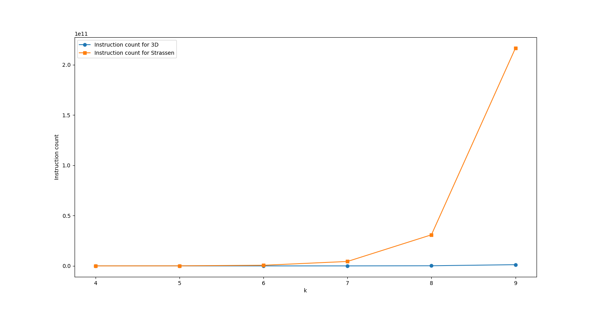
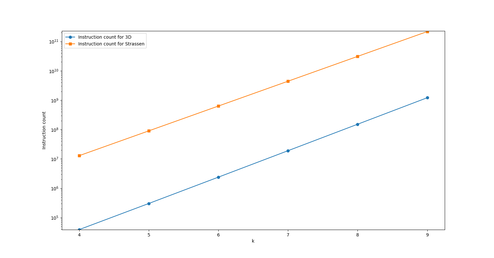
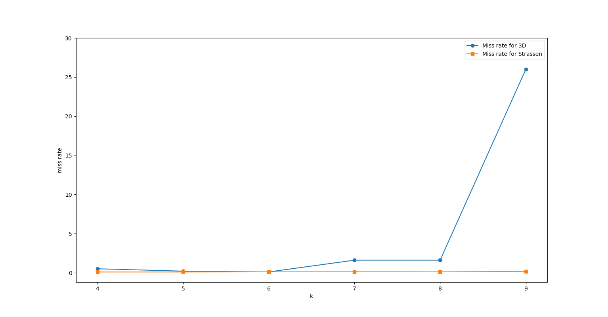
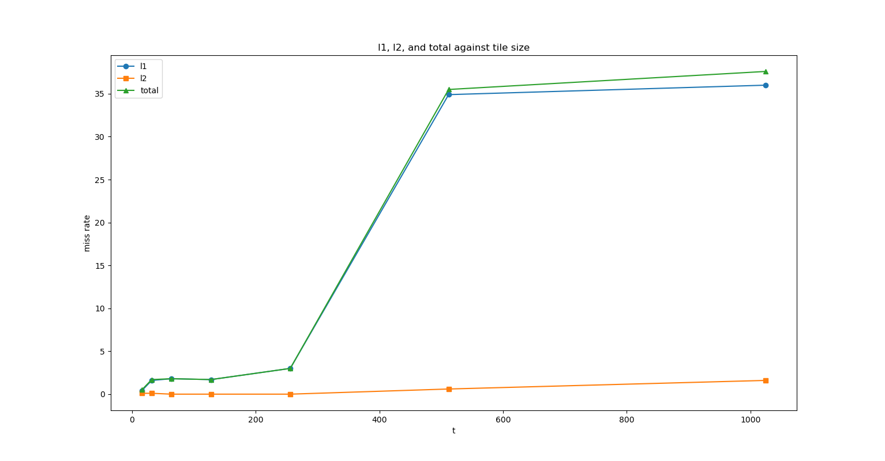
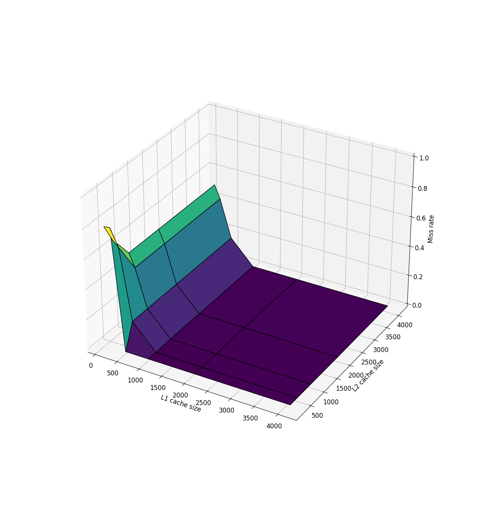

# Assignment Report - Ajit S 2021112023
Note that the system being used is a modified wsl-kernel, a slightly different perf needed to be compiled (as perf is kernel specific)... hence the L2 and LLC based events were unavailable...a different pc has been used for those alone.

All the cachegrind files are in the cache_grind_outs folders, and were analysed using cg_annotate function... to know which cachegind out file corresponds to which one, check the txt files most of which are just the terminal directly copied.

Most of the codes' parameters like (TILE_SIZE or N or TYPE wherever required) have been defined and can be changed during compile time as ```-D{parameter}``` this makes it easier for running the shell scripts provided as well

## Q1
codes were compiled with ```-Ofast -march=native -pthread -g``` flags (and bw/flops code with O3 instead of Ofast)
### a. q1a.c
### b. q1b.c
### c. q1c.c
### d. teststream.c membwtest.c bw_bench_halfway.txt bw_graph.png Q1_some_bw.txt Q1_some_perfs.txt
calulated BW given in Q1_some_bw.txt (around 28GB/s from teststream.c which is a tuned version of the stream reference mentioned below)....

the standard benchmark results (https://zsmith.co/bandwidth.php) are given in bw_bench_halfway.txt

Main references :
1) https://m.youtube.com/watch?v=nXaxk27zwlk (CppCon 2015: Chandler Carruth "Tuning C++: Benchmarks, and CPUs, and Compilers)
2) /* Program: STREAM                                                       */
/* Revision: $Id: stream.c,v 5.10 2013/01/17 16:01:06 mccalpin Exp mccalpin $ */
/* Original code developed by John D. McCalpin                           */
/* Programmers: John D. McCalpin                                         */
/*              Joe R. Zagar  
https://www.cs.virginia.edu/stream/


for the benchmarks, a main problem was the compiler optimising stuff too much.... solution to this (the below functions) was given in ref [1]. 

```c 
static void escape(void *p){
    asm volatile("" : : "g"(p) : "memory");
}

static void clobber(){
    asm volatile("" : : : "memory");
}
```

The membwtest.c is another implementation done to find the bandwidth....Initally was Getting slightly under half the theoretical memory bandwidth mainly because the cache in modern processors are complicated. The main problem is that memory traffic on the bus is done in units of cache lines, which tend to be larger than 32 bytes. In order to write only 32 bytes, the cache must first read the entire cache line from memory and then modify it. Unfortunately, this means that my program, which only writes values, will actually cause double the memory traffic I expect because it will cause reads of cache line! As you can see from the picture below, the bus traffic (the blue lines out of the processor) per cache line is a read and a write to memory.

solution? non-temporal instructions... https://www.akkadia.org/drepper/cpumemory.pdf

so this membwtest.c uses rep to repeat a specific string instruction.... inline assembly is used here

```c
void write_memory_rep_stosq(void* buffer, size_t size) {
  asm("cld\n"
      "rep stosq"
      : : "D" (buffer), "c" (size / 8), "a" (0) );
}
```

### e.  gflops.c Q1_flops.txt Q1_some_perf.txt

Theoretical peak gflops :-
```
peak_flops/s = (#processors) x (cores_per_processor) x (clock_speed [1/s]) x (2 x #FMA_units) x vector_size[bits]/64 
```
(as given in main ref [1])

intel 10th gen i7 uses Skylake architecture with AVX-512 ISA has 32 64bit-Floating-point operations per clock cycle per core (or 64 32-bit FP)  [2]

__see Q1_flops.txt__

Main references:
1) https://en.wikipedia.org/wiki/FLOPS
2) https://aiichironakano.github.io/cs596/PeakFlops.pdf


### f. Q1_some_perf

Using perf, we can see that the programs are all __memory__ bound as the a program is ``` compute bound => Operational intensity > Peak GFlops/BW``` 

The __scalar dot product__ has 2n operations and access 2n x 4 = 8n bytes => __1/4 Operations per byte__
The __vector dot product__ has 2 x n / 8 operations (SIMD instructions) and access 2n x 4 = 8n bytes => __1/32 Operations per byte__
and similarly the alternate vector dot product uses [2 x (n/2) /8] / (2n x 4) = __1/64 Operations per byte__

so on doing roofline analysis, we find that in our case, all of them are memory bound because the operational intensity is lower than the gflops we get...we can also say this as even on increasing n, the cpu wasnt fully utilised, meaning it was memory bound....we also need to note that among these, the __q1a__ (scalar dot product) was the closest to being compute bound


## Q2
Look at the plots in ``` inst_count.png inst_count_logscale.png miss_rate.png miss_rate_tiled.png  ```
The file names have been made self-explanatory...
the first line of some of the files include the compile instructions... other compile instructions(if any) can be found from the txt documents
an example of the compilation is shown below

Note that all of this have been generated using values from cachegrind (cg_annotate with source) , the cachegrind outputs have been given in the folder.

*****

Data for instruction count (3d (n) and strassen (s)) (from perf tree)
```
t = [4, 5, 6, 7, 8, 9]
n_i = [39082, 303402, 2392618, 19006506, 151521322, 1210060842]
s_i = [12870766, 90055885, 630468356, 4416439131, 30921306111, 216438210165]
```
 
(same as above but in logrithmic scale)


****
Data for miss rates (3d (n) and strassen (s)) from cg_annotate
```
t = [4, 5, 6, 7, 8, 9]
n_r = [0.5, 0.2, 0.1, 1.6, 1.6, 26.0]
s_r = [0.09, 0.09, 0.11, 0.12, 0.11, 0.17]
```




****


cache miss data for tiled multi
```
t = [16, 32, 64, 128, 256, 512, 1024]
l1 = [0.4, 1.6, 1.8, 1.7, 3.0, 34.9, 36.0]
l2 = [0.1, 0.1, 0.0, 0.0, 0.0, 0.6, 1.6]
total = np.array(l1) + np.array(l2) 
```



```sh
g++ -O3 -DTILE_SIZE=16 -DN=512 matmul_tiled.cpp -o matmul_tiled.out && sudo /usr/lib/linux-tools/5.4.0-149-generic/perf stat -e task-clock,cycles,instructions,cache-references,cache-misses -d ./matmul_tiled.out
```

all the cachegrind outputs have been analysed using ```cg_annotate cachegrind.out.{pid} {source file} ```

### b.
example from Q2b_some_perf.txt (mainly just for finding instructions and instructions per cycle)... cache miss ratios have been found using chachegrind and have been plotted in the figures
``` 
Running with N=128
 Performance counter stats for './matmul_recursive_strassen.out':

            303.50 msec task-clock                #    0.999 CPUs utilized
        1219996934      cycles                    #    4.020 GHz
        4132276432      instructions              #    3.39  insn per cycle
           1039478      cache-references          #    3.425 M/sec
            257715      cache-misses              #   24.793 % of all cache refs
        1096428329      L1-dcache-loads           # 3612.627 M/sec
           1101840      L1-dcache-load-misses     #    0.10% of all L1-dcache hits
   <not supported>      LLC-loads
   <not supported>      LLC-load-misses

       0.303885077 seconds time elapsed

       0.303820000 seconds user
```

We can see that as N increases, the number of instructions increase exponentially, (~ 8^x * 25)...in this example with N=128, using recursice strassen, the number of instructions were 4132276432, but note that this is the total number of instruction for the program and not for the computation, the one for just the matrix multiplication has been found out using ```perf call-graph``` which is slightly lower, however this is a good enough approximation and doesnt have any effect on the trend...
similarly the CPI is around 1/3.39 for this, the variation in the doesnt have a bit pattern, but the CPI was greater for the recursive strassen method even though the 3d loop was much faster
Now for the cache miss ratio, we see that the recursive strassen has almost the same cache miss ratio (around 0.25), but the cache miss ratio keeps increasing for the normal 3d loop (around 0.4% all the way to 40%) (and also for tiled), this is because as N increases, the probability of a row remaining in cache decreases as it gets flushed out when the next rows are to be fetched (or prefetched). Note that the more accurate cache miss values are calculated based on the call-graph to see how many misses our function gets.

### c.

We find the optimal tile size to be 16 (similar to 32).

we also see that the cache miss ratio starts low and saturates at a high value (around 35%) with the tile size... the optimal tile size was found based on runtime... runtime starts to increase, then decreases as can be seen in the txt files.

fromt he Q2c_some_perf.txt, the instruction count for recursive strassen is around 202288217196 and for tiled is around 1327355655, hence we see that the tiled version takes up less number of instructions thant the strassen method (for TILE_SIZE of 16)

## Q3 


```
l1_s = [128, 128, 128, 128, 128, 256, 256, 256, 256, 256, 512, 512, 512, 512, 1024, 1024, 1024, 2048, 2048, 4096]
l2_s = [256, 512, 1024, 2048, 4096, 256, 512, 1024, 2048, 4096, 512, 1024, 2048, 4096, 1024, 2048, 4096, 2048, 4096, 4096]
r = [0.8, 0.674, 0.508, 0.508, 0.508, 0.805, 0.637, 0.42, 0.42, 0.42, 0.164, 0.164, 0.164, 0.164, 0.004, 0.004, 0.004, 0.004, 0.004, 0.004]

```

the results have been plotted in q3plot.png ... 
for full assotiativity, associativity of the cache needs to be equal to the number of cache lines. The number of cache lines is calculated as the cache size divided by the line size.
we also see that the L2 cache value doenst affect it much, and the miss ratio also gets saturated at a low value as L1 cache value increases... one of the optimal configs are L1 cache size 8192 bytes and L2 size 8192 bytes.


